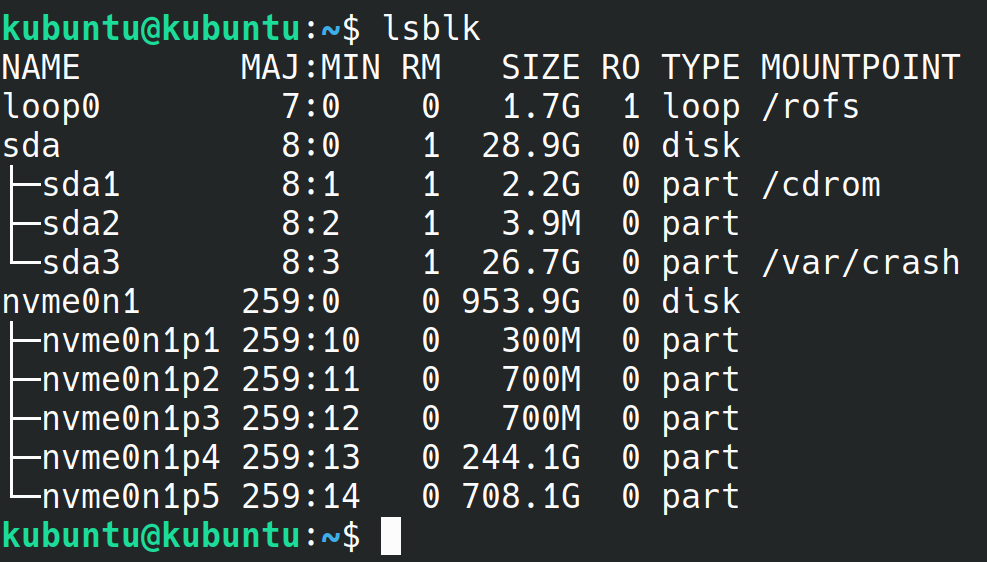

# Use LUKS to encrypt ubuntu partitions
TODO intro

## rationale
TODO

## basics
TODO

## references
TODO

## tools
TODO

LVM and LUKS

commands:
- lsbkl
- cryptsetup
- pvcreate
- vgcreate
- lvcreate


## waring
TODO: backup warning
TODO: disk wiping warning

## instructions
First you want to partition your drive

Assuming you use uefi(todo:link to uefi) you want to have:
 - one ESP patition (todo: link to esp) (around 200/300 mb)
 - one partition **for each** ubuntu installation that will be mounted as */boot* (around 500mb), this partition will contain the bootloader (grub) and the kernels. (Such partition will not be encrypted) 
 - one partition **for each** ubuntu installation that we will encrypt using luks that will contain our */*, *swap* (and */home* if you like)



you can use tools like *gparted* or *partitionmanager* (on kde) to edit your partition table (gpt on uefi) to reach the result above.

Our next step is to encrypt the partitions that will contain the data we would like to protect.

``` bash
sudo cryptsetup luksFormat --hash=sha512 --key-size=512 /dev/nvme0n1p4
sudo cryptsetup luksFormat --hash=sha512 --key-size=512 /dev/nvme0n1p5
sudo cryptsetup open --type=luks /dev/nvme0n1p4 work
sudo cryptsetup open --type=luks /dev/nvme0n1p5 personal
```

create a pysical volume and volume gruop and then create logical volumes as you please (in my case one for root and the other for the swap partition)
``` bash
sudo pvcreate /dev/mapper/work 
sudo vgcreate wvg /dev/mapper/work 
sudo lvcreate -L 8G wvg -n swap
sudo lvcreate -l 100%FREE wvg -n root
```
TODO: I was not sure if the swap could be shared safely so I've opted to inclue the swap as a logical volume

repeat the same for other partitions
``` bash
sudo pvcreate /dev/mapper/personal
sudo vgcreate pvg /dev/mapper/personal
sudo lvcreate -L 8G pvg -n swap
sudo lvcreate -l 100%FREE pvg -n root
```
tip: if you make mistakes, commands such as lvrename are available 
tip: use regularly lsblk to check if you are getting the result you would 

Use lsblk to get the uuid of the parition 
for instance in my case the uuid I have to take note is `48b7b2e4-4c03-4339-98f8-672e897ea5fc`

``` bash
kubuntu@kubuntu:~$ sudo  lsblk -o name,uuid,mountpoint
NAME           UUID                                   MOUNTPOINT
loop0                                                 /rofs
sda            2020-04-23-07-59-42-00                 
├─sda1         2020-04-23-07-59-42-00                 /cdrom
├─sda2         1AC3-20ED                              
└─sda3         c278ed1f-6ac6-41a1-9074-7db516723945   /var/crash
nvme0n1                                               
├─nvme0n1p1    6BFB-F958                              
├─nvme0n1p2    1b0a7b5a-d724-4727-9ebc-06cd099ac37d   /mnt/boot
├─nvme0n1p3    5702f183-eb74-49ff-9e8b-79515e103e1b   
├─nvme0n1p4    48b7b2e4-4c03-4339-98f8-672e897ea5fc   
│ └─work       DpOYw5-Pivu-edGh-Ngqh-UTSN-jXL7-uXlP1H 
│   ├─wvg-swap 9cdc59eb-9e97-4e7b-a1fa-56eced8f83f1   
│   └─wvg-root 22c6b822-f9be-40e0-84b7-def2548466c0   /mnt
└─nvme0n1p5    614c65f4-821a-47ba-853e-c49e1921631a   
kubuntu@kubuntu:~$ 
```

Now we need to chroot(TODO: link) in the installed ubuntu and configure crypttab 
``` bash
sudo mount /dev/mapper/wvg-root /mnt
sudo mount /dev/nvme0n1p2 /mnt/boot
sudo mount --bind /dev /mnt/dev
sudo chroot /mnt
mount -t proc proc /proc
mount -t sysfs sys /sys
mount -t devpts devpts /dev/pts
sudo nano /etc/crypttab
```
the content of your */etc/cypttab* should look like this:
```
work UUID=48b7b2e4-4c03-4339-98f8-672e897ea5fc none luks,discard
```

last but not least
``` bash
update-initramfs -k all -c
```

tip: this should scream some warnings if there is a mistake with crypttab. 
In such case check again and fix the content of /etc/crypttab.


TODO: not sure if all the mount commants are necessary.

[encrypting disks on ubuntu]: https://medium.com/@chrishantha/encrypting-disks-on-ubuntu-19-04-b50bfc65182a
[arch lvm on luks]: https://wiki.archlinux.org/index.php/Dm-crypt/Encrypting_an_entire_system#LVM_on_LUKS
[arch wipe disk]: todo
[boot process]: https://linuxhint.com/understanding_boot_process_bios_uefi/
[cypttab]: todo
